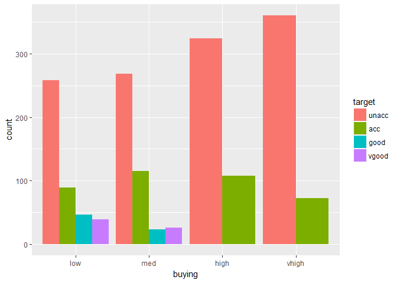
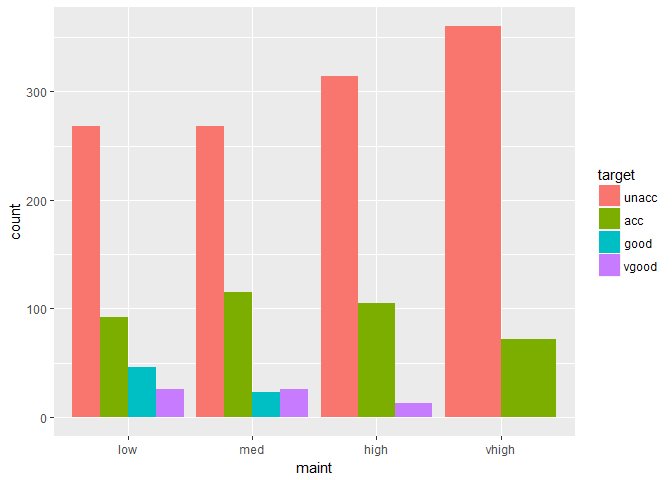
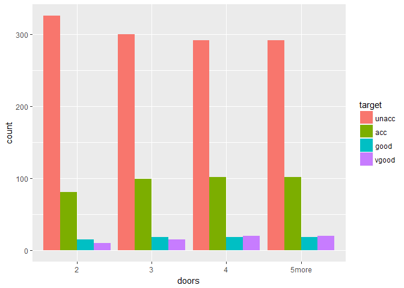
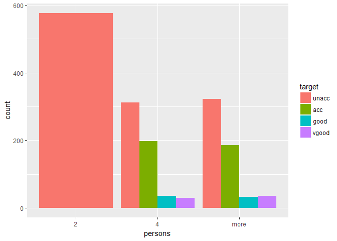
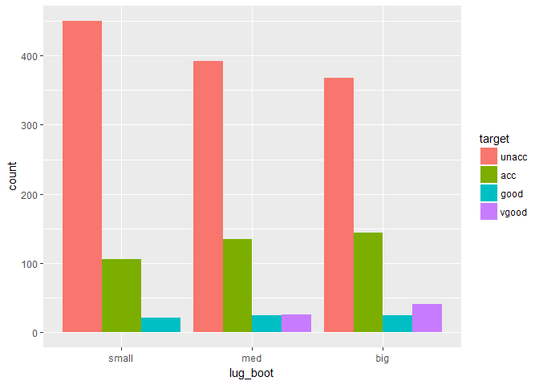
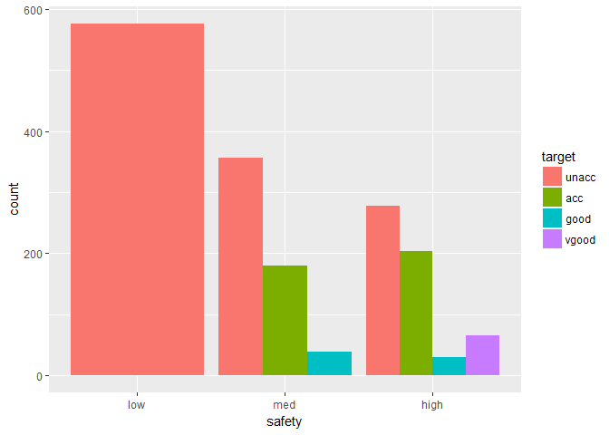

car\_evaluation.Rmd
================
Arun
January 17, 2018

### Machine Learning Gladiator

Firstly, we try to compare bootstrapping,repeated cross validation and k-fold cross validation with upsampling,downsampling and smote. For all these purposes, Car Evaluation Dataset is used. Secondly, we use the best option to identify the better algorithm for this method.

Lets load the required packages.

``` r
#load packages
suppressPackageStartupMessages(library(data.table))
suppressPackageStartupMessages(library(ggplot2))
suppressPackageStartupMessages(library(tidyverse))
suppressPackageStartupMessages(library(caret))
suppressPackageStartupMessages(library(DMwR))
suppressPackageStartupMessages(library(doSNOW))
```

We'll set the seed for reproducibility of results.

``` r
set.seed(12345)
```

Load the data using fread()

``` r
#load data
data <- fread("data.csv",na.strings = c(""," ","?","NA",NA))
```

Modify the column names and do some data preprocessing

``` r
#View data & modify column names
head(data)
```

    ##       V1    V2 V3 V4    V5   V6    V7
    ## 1: vhigh vhigh  2  2 small  low unacc
    ## 2: vhigh vhigh  2  2 small  med unacc
    ## 3: vhigh vhigh  2  2 small high unacc
    ## 4: vhigh vhigh  2  2   med  low unacc
    ## 5: vhigh vhigh  2  2   med  med unacc
    ## 6: vhigh vhigh  2  2   med high unacc

``` r
names(data) <- c("buying","maint","doors","persons","lug_boot","safety","target")

data <- data %>% 
            mutate_if(is.character,as.factor)

data$buying <- factor(data$buying, levels = c("low", "med", "high","vhigh"))
data$maint <- factor(data$maint, levels = c("low", "med", "high","vhigh"))
data$lug_boot <- factor(data$lug_boot, levels = c("small", "med", "big"))
data$safety <- factor(data$safety, levels = c("low", "med", "high"))
data$target <- factor(data$target, levels = c("unacc", "acc", "good","vgood"))
```

Lets plot to observe the effects of features on target variable.

``` r
ggplot(data, aes(buying, ..count..)) + 
  geom_bar(aes(fill = target), position = "dodge")
```



``` r
ggplot(data, aes(maint, ..count..)) + 
  geom_bar(aes(fill = target), position = "dodge")
```



``` r
ggplot(data, aes(doors, ..count..)) + 
  geom_bar(aes(fill = target), position = "dodge")
```



``` r
ggplot(data, aes(persons, ..count..)) + 
  geom_bar(aes(fill = target), position = "dodge")
```



``` r
ggplot(data, aes(lug_boot, ..count..)) + 
  geom_bar(aes(fill = target), position = "dodge")
```



``` r
ggplot(data, aes(safety, ..count..)) + 
  geom_bar(aes(fill = target), position = "dodge")
```



Get the sample indexes for splitting the training data.

``` r
#Sample Indexes
indexes = sample(1:nrow(data), size=0.2*nrow(data))
```

Split the data

``` r
# Split data
validation = data[indexes,]
dim(validation)
```

    ## [1] 345   7

``` r
train = data[-indexes,]
dim(train)
```

    ## [1] 1383    7

``` r
target<-validation$target
validation$target<-NULL
```

Define a function for calculating the metrics score, namely micro-average F1 score and macro average F1 score.

``` r
metrics_fun<-function(cm){
  n = sum(cm) #number of observations
  nc = nrow(cm) #number of clases
  diag = diag(cm) # correct predictions 
  rowsums = apply(cm, 1, sum) # number of observations per class
  colsums = apply(cm, 2, sum) # number of predictions per class
  
  #Accuracy 
  sum(diag/n)
  #Precision Recall F1 for each class
  precision = diag / colsums 
  recall = diag / rowsums 
  f1 = 2 * precision * recall / (precision + recall) 
  #data.frame(precision, recall, f1) 
  
  #Macroaverage F score
  
  macroPrecision = mean(precision)
  macroRecall = mean(recall)
  macroF1 = mean(f1)
  cat("MacroF1:",macroF1)
  #data.frame(macroPrecision, macroRecall, macroF1)
  
  #One vs All
  
  oneVsAll = lapply(1 : nc,
                    function(i){
                      v = c(cm[i,i],
                            rowsums[i] - cm[i,i],
                            colsums[i] - cm[i,i],
                            n-rowsums[i] - colsums[i] + cm[i,i]);
                      return(matrix(v, nrow = 2, byrow = T))})
  #oneVsAll
  
  sumOfAll = matrix(0, nrow = 2, ncol = 2)
  for(i in 1 : nc){sumOfAll = sumOfAll + oneVsAll[[i]]}
  #sumOfAll
  
  #Average Accuracy
  avgAccuracy = sum(diag(sumOfAll)) / sum(sumOfAll)
  
  #Microaverage F score
  micro_prf = (diag(sumOfAll) / apply(sumOfAll,1, sum))[1]
  cat("\nMicro F1 score:",micro_prf)
}
```

Now, lets define the model and store the confusion matrix of predictions for Bootstrapping with up sampling.

``` r
###Bootstrap with upsampling
set.seed(12345)
cl <- makeCluster(6, type = "SOCK")
registerDoSNOW(cl)
# define training control
train_control <- trainControl(method="boot632", number=100,sampling = "up")
# train the model
model1 <- caret::train(target~., data=train, trControl=train_control,
               method="rf")
# summarize results
model1.pred <- predict(model1,validation)
confmat1 = as.matrix(table(Actual = target, Predicted = model1.pred))
stopCluster(cl)
```

Bootstrapping with down sampling

``` r
set.seed(12345)
c2 <- makeCluster(6, type = "SOCK")
registerDoSNOW(c2)
train_control <- trainControl(method="boot632", number=100,sampling = "down")
model2 <- caret::train(target~., data=train, trControl=train_control,
                      method="rf")
model2.pred <- predict(model2,validation)
confmat2 = as.matrix(table(Actual = target, Predicted = model2.pred))
stopCluster(c2)
```

Bootstrapping with smote

``` r
set.seed(12345)
c3 <- makeCluster(6, type = "SOCK")
registerDoSNOW(c3)
train_control <- trainControl(method="boot632", number=100,sampling = "smote")
model3 <- caret::train(target~., data=train, trControl=train_control,
                      method="rf")
model3.pred <- predict(model3,validation)

confmat3 = as.matrix(table(Actual = target, Predicted = model3.pred))
stopCluster(c3)
```

RepeatedCV with upsampling

``` r
set.seed(12345)
c4 <- makeCluster(6, type = "SOCK")
registerDoSNOW(c4)
ctrl <- trainControl(method = "repeatedcv",
                     number=10,
                     repeats = 3,
                     sampling = "up")
model4 <- caret::train(target~., data=train, trControl=ctrl,
                      method="rf")
model4.pred <- predict(model4,validation)

confmat4 = as.matrix(table(Actual = target, Predicted = model4.pred))
stopCluster(c4)
```

RepeatedCV with downsampling

``` r
set.seed(12345)
c5 <- makeCluster(6, type = "SOCK")
registerDoSNOW(c5)
ctrl <- trainControl(method = "repeatedcv",
                     number=10,
                     repeats = 3,
                     sampling = "down")
model5 <- caret::train(target~., data=train, trControl=ctrl,
                       method="rf")
model5.pred <- predict(model5,validation)

confmat5 = as.matrix(table(Actual = target, Predicted = model5.pred))
stopCluster(c5)
```

RepeatedCV with smote

``` r
set.seed(12345)
c6 <- makeCluster(6, type = "SOCK")
registerDoSNOW(c6)
ctrl <- trainControl(method = "repeatedcv",
                     number=10,
                     repeats = 3,
                     sampling = "smote")
model6 <- caret::train(target~., data=train, trControl=ctrl,
                       method="rf")
model6.pred <- predict(model6,validation)

confmat6 = as.matrix(table(Actual = target, Predicted = model6.pred))
stopCluster(c6)
```

K-Fold CV with upsampling

``` r
set.seed(12345)
c7 <- makeCluster(6, type = "SOCK")
registerDoSNOW(c7)
ctrl <- trainControl(method = "cv",
                     number=10,
                     sampling = "up")
model7 <- caret::train(target~., data=train, trControl=ctrl,
                       method="rf")
model7.pred <- predict(model7,validation)

confmat7 = as.matrix(table(Actual = target, Predicted = model7.pred))
stopCluster(c7)
```

k-Fold CV with downsampling

``` r
set.seed(12345)
c8 <- makeCluster(6, type = "SOCK")
registerDoSNOW(c8)
ctrl <- trainControl(method = "cv",
                     number=10,
                     sampling = "down")
model8 <- caret::train(target~., data=train, trControl=ctrl,
                       method="rf")
model8.pred <- predict(model8,validation)

confmat8 = as.matrix(table(Actual = target, Predicted = model8.pred))
stopCluster(c8)
```

k-Fold CV with smote

``` r
set.seed(12345)
c9 <- makeCluster(6, type = "SOCK")
registerDoSNOW(c9)
ctrl <- trainControl(method = "cv",
                     number=10,
                     sampling = "smote")
model9 <- caret::train(target~., data=train, trControl=ctrl,
                       method="rf")
model9.pred <- predict(model9,validation)

confmat9 = as.matrix(table(Actual = target, Predicted = model9.pred))
stopCluster(c9)
```

Now,lets compare our results to find the best model among the above.

``` r
metrics_fun(confmat1)
```

    ## MacroF1: 0.8480236
    ## Micro F1 score: 0.9478261

``` r
metrics_fun(confmat2)
```

    ## MacroF1: 0.5583136
    ## Micro F1 score: 0.6985507

``` r
metrics_fun(confmat3)
```

    ## MacroF1: 0.565931
    ## Micro F1 score: 0.7913043

``` r
metrics_fun(confmat4)
```

    ## MacroF1: 0.8560097
    ## Micro F1 score: 0.942029

``` r
metrics_fun(confmat5)
```

    ## MacroF1: 0.6303809
    ## Micro F1 score: 0.7391304

``` r
metrics_fun(confmat6)
```

    ## MacroF1: 0.6530739
    ## Micro F1 score: 0.8347826

``` r
metrics_fun(confmat7)
```

    ## MacroF1: 0.8532135
    ## Micro F1 score: 0.9449275

``` r
metrics_fun(confmat8)
```

    ## MacroF1: 0.613031
    ## Micro F1 score: 0.7275362

``` r
metrics_fun(confmat9)
```

    ## MacroF1: 0.6182471
    ## Micro F1 score: 0.8347826

Our dataset is Imbalanced. So microaverage F1 score is preferable. One has the best microaverage F1 score. That is 10 fold cv with up sampling works best.

**Now, lets compare different algorithms**

K-Fold CV with XG Boost Tree algorithm

``` r
set.seed(12345)
c201 <- makeCluster(6, type = "SOCK")
registerDoSNOW(c201)
ctrl <- trainControl(method="boot632", number=100,sampling = "up")
model_xgbtree <- caret::train(target~., data=train, trControl=ctrl,
                       method="xgbTree")
model_xgbtree.pred <- predict(model_xgbtree,validation)

confmat_xgbtree = as.matrix(table(Actual = target, Predicted = model_xgbtree.pred))
stopCluster(c201)
```

k-Fold CV with XG Boost Linear Alogrithm

``` r
set.seed(12345)
c202 <- makeCluster(6, type = "SOCK")
registerDoSNOW(c202)
ctrl <- trainControl(method="boot632", number=100,sampling = "up")
model_xgblinear <- caret::train(target~., data=train, trControl=ctrl,
                              method="xgbLinear")
model_xgblinear.pred <- predict(model_xgblinear,validation)

confmat_xgblinear = as.matrix(table(Actual = target, Predicted = model_xgblinear.pred))
stopCluster(c202)
```

k-Fold CV with Gradient Boosted Machine algorithm

``` r
set.seed(12345)
c203 <- makeCluster(6, type = "SOCK")
registerDoSNOW(c203)
ctrl <- trainControl(method="boot632", number=100,sampling = "up")
model_gbm <- caret::train(target~., data=train, trControl=ctrl,
                                method="gbm")
```

    ## Iter   TrainDeviance   ValidDeviance   StepSize   Improve
    ##      1        1.3863             nan     0.1000    0.1938
    ##      2        1.2588             nan     0.1000    0.1408
    ##      3        1.1656             nan     0.1000    0.1185
    ##      4        1.0889             nan     0.1000    0.0807
    ##      5        1.0351             nan     0.1000    0.0836
    ##      6        0.9817             nan     0.1000    0.0646
    ##      7        0.9383             nan     0.1000    0.0636
    ##      8        0.8973             nan     0.1000    0.0861
    ##      9        0.8408             nan     0.1000    0.0702
    ##     10        0.7975             nan     0.1000    0.0478
    ##     20        0.5652             nan     0.1000    0.0159
    ##     40        0.3613             nan     0.1000    0.0100
    ##     60        0.2625             nan     0.1000    0.0037
    ##     80        0.2042             nan     0.1000    0.0032
    ##    100        0.1638             nan     0.1000    0.0028
    ##    120        0.1369             nan     0.1000    0.0020
    ##    140        0.1174             nan     0.1000    0.0005
    ##    150        0.1094             nan     0.1000    0.0007

``` r
model_gbm.pred <- predict(model_gbm,validation)
confmat_gbm = as.matrix(table(Actual = target, Predicted = model_gbm.pred))
stopCluster(c203)
```

k-Fold CV with svmLinear algorithm

``` r
set.seed(12345)
c204 <- makeCluster(6, type = "SOCK")
registerDoSNOW(c204)
ctrl <- trainControl(method="boot632", number=100,sampling = "up")
model_svm <- caret::train(target~., data=train, trControl=ctrl,
                          method="svmLinear")
model_svm.pred <- predict(model_svm,validation)
confmat_svm = as.matrix(table(Actual = target, Predicted = model_svm.pred))
stopCluster(c204)
```

Now, lets compare these to find out the better algorithm when hyperparameters are not fully optimized.

``` r
metrics_fun(confmat_xgbtree)
```

    ## MacroF1: 0.9753548
    ## Micro F1 score: 0.9942029

``` r
metrics_fun(confmat_xgblinear)
```

    ## MacroF1: 0.997976
    ## Micro F1 score: 0.9971014

``` r
metrics_fun(confmat_gbm)
```

    ## MacroF1: 0.9255857
    ## Micro F1 score: 0.9623188

``` r
metrics_fun(confmat_svm)
```

    ## MacroF1: 0.8671832
    ## Micro F1 score: 0.9304348

The results show that XG boost algorithms are a lot better than the others. Among the two, xgblinear algorithm works best for this particular problem.

**Note:** - The different algorithms are compared with default values of hyperparameters. If the hyperparameters are optimized separately for each and then if they are compared, results might change.
